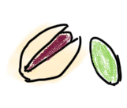
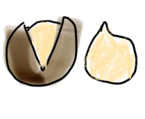
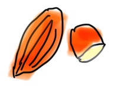
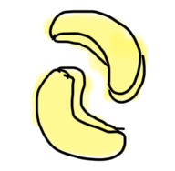
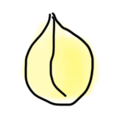
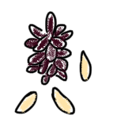
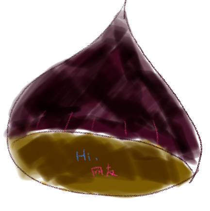
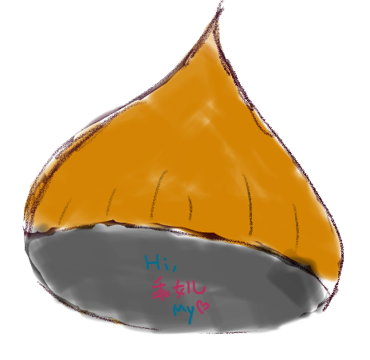

# Project Chestnut can 
Lots of chestnuts, in one can. Chestnut Can!

### mapping number to nuts

- 2 - 
- 4 - 
- 8 - 
- 16 - 
- 32 - 
- 64 - 
- 128 - 
- 256 - 
- 512 - 
- 1024 - 
- 2048 - 
- 4096 - 

